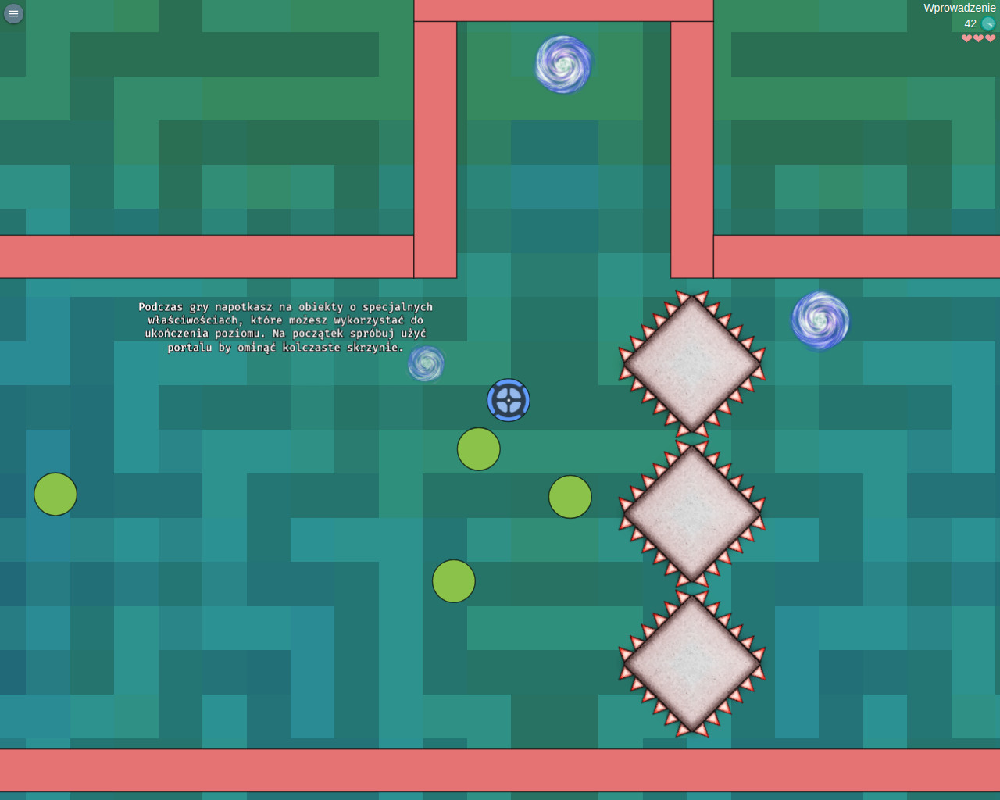
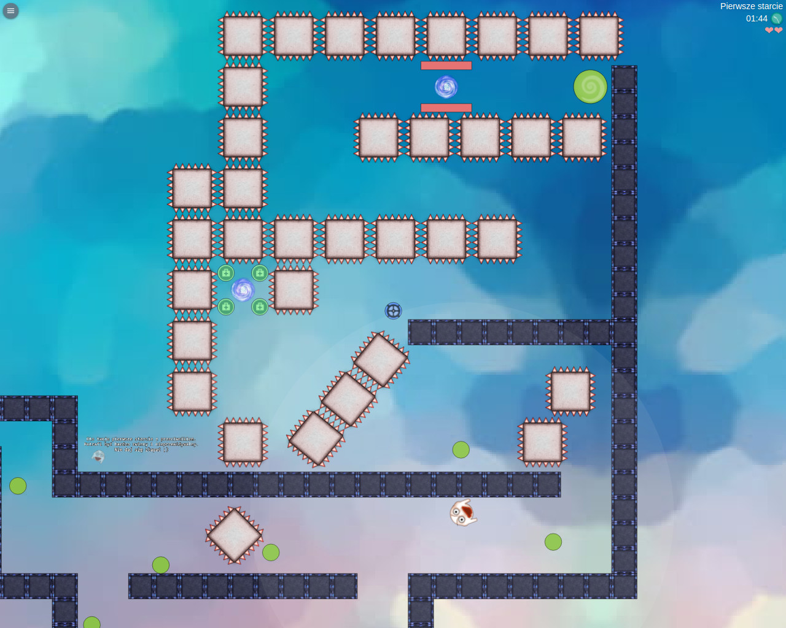
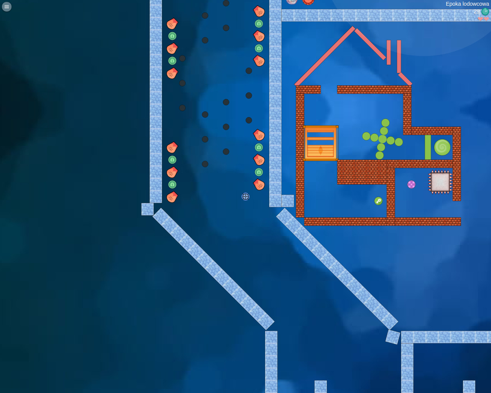
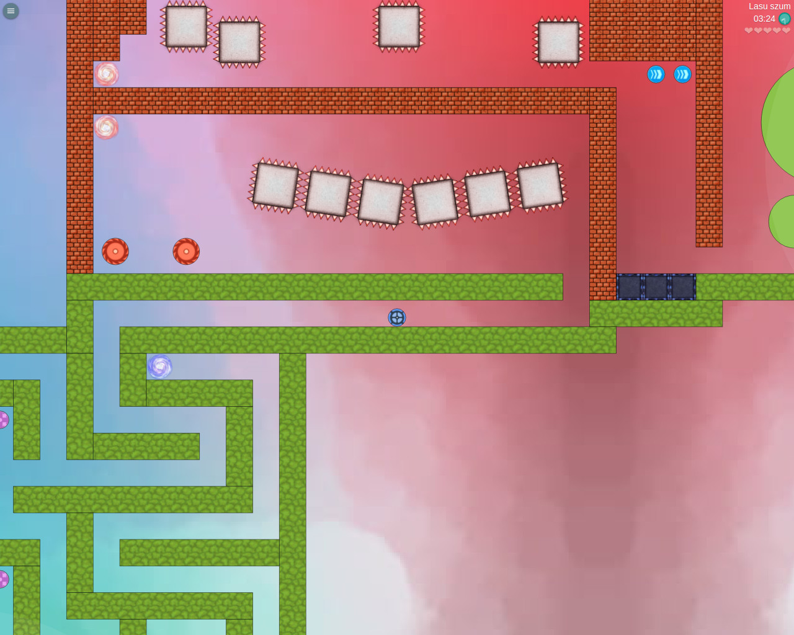

<h2>ZeroG-Ball</h2>
Logic game with simple, custom physics engine based on elastic collisions.
Game has been created for university project.

<h2>How to setup project</h2>
<ul>
	<li>Make sure to have nodejs, npm and git installed on your system</li>
	<li>
		Clone repository:
		<pre>git clone https://github.com/Aktyn/ZeroG-Ball cd ZeroG-Ball</pre>
	</li>
	<li>
		Install necessary dependencies
		<pre>npm install</pre>
	</li>
	<li>
		To open app in development mode run: <pre>npm run dev</pre> (make sure port 3000 is not in use)
	</li>
	<li>
		To compile app into production ready code run:
		<ul>
			<li>Windows:<pre>npm run w:publish</pre></li>
			<li>Unix systems:<pre>npm run publish</pre></li>
		</ul>
		Files will be generated inside <b>dist</b> folder
	</li>
	<li>
		To display list of all custom project options run <pre>npm run</pre>
		Or take a look into package.json, section: "scripts" 
	</li>
	<li>
		There is also a server-side code that you can run with:<pre>npm run server</pre>
		Server is used for storing user's best results. 
		By default, client is connecting to server on same hostname. 
		In order to use custom host address you must change the window.SERVER_HOST value in index.html.
	</li>
</ul>

<h2>Some screenshots</h2>

